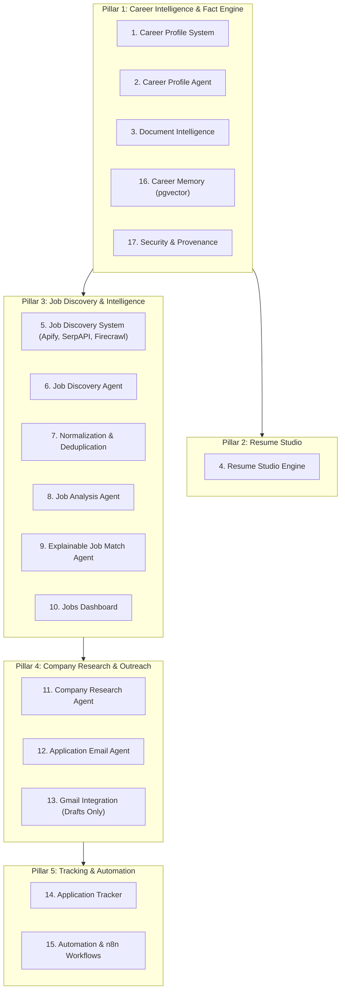

# YourCareer Buddy - Master Architecture & System Blueprint
> **AI Career Operating System**

---

## 🎯 Vision Overview
**YourCareer Buddy** is a unified, end-to-end **AI Career Operating System**. It eliminates the need for fragmented job-seeking tools by seamlessly integrating career profile management, intelligent document parsing, tailored resume generation, automated multi-provider job discovery, explainable AI job matching, deep company research, draft-based email outreach, application tracking, and workflow automation.

---

## 🏗️ The 17 Core Subsystems Across 5 Pillars



---

### Pillar 1: Career Intelligence & Fact Engine

#### 1. 👤 Career Profile System
* **Scope**: Serves as the single source of truth (Canonical Profile) containing personal details, education, work history, verified skills, projects, certifications, social/portfolio links (GitHub, LinkedIn), and job preferences (role, target salary, remote/onsite).
* **Storage**: Relational schema with strict data validation to prevent AI hallucination.

#### 2. 🤖 Career Profile Agent
* **Scope**: Conversational agent that interviews the user in natural language to gather missing details (e.g., *"What was your primary stack on project X?"* or *"How many years of Python experience do you have?"*).
* **Rule**: Strict zero-hallucination constraint — only facts explicitly stated or confirmed by the user are saved.

#### 3. 📄 Document Intelligence
* **Scope**: Multi-format document parser (CVs, Resumes, Certificates, Transcripts, PDFs, DOCX).
* **Workflow**: Extracts structured facts, assigns confidence scores, and presents extracted details to the user for human-in-the-loop confirmation before adding to the Canonical Profile.

#### 16. 🧠 Career Memory
* **Scope**: Semantic memory powered by `pgvector` embeddings to store project histories, career trajectory patterns, and past custom resume variations for instant semantic retrieval.

#### 17. 🔐 Security, Provenance & Governance
* **Scope**: Core architectural guardrails:
  * User isolation & tenant boundary enforcement.
  * Server-side secret management (API keys never exposed to the frontend).
  * Fact Provenance Tracking: Distinction between `USER_CONFIRMED` facts vs `AI_EXTRACTED` proposals.
  * External web content marked as untrusted (sanitized against prompt injection).
  * Mandatory Human-in-the-Loop approval for high-consequence external actions (e.g., sending emails).

---

### Pillar 2: Resume Studio

#### 4. 📄 Resume Studio
* **Scope**: Generates targeted, beautifully formatted resumes (ATS-optimized, Modern Professional, Technical) based on the user's canonical profile.
* **Tailoring Engine**: Takes a target job posting description, analyzes key skill signals, and reorders/highlights genuine user experiences without inventing qualifications.

---

### Pillar 3: Job Discovery, Normalization & Intelligence

#### 5. 🔍 Job Discovery System
* **Providers**: Multi-provider scraper pipeline integrating **Apify** (LinkedIn, Indeed, Glassdoor scrapers), **SERP API** (Google Jobs), and **Firecrawl** (Direct company career pages).

#### 6. 🧠 Job Discovery Agent
* **Scope**: Translates complex, natural language user queries (e.g., *"Find remote AI Engineer roles in Europe or Pakistan with salary > $80k"*) into optimized search parameters across all discovery providers.

#### 7. 🧹 Job Normalization & Deduplication
* **Engine**: Standardizes disparate payload schemas, extracts canonical URLs, calculates fingerprint hashes (Company + Title + Location + Normalized Description similarity using MinHash/Cosine distance), and merges duplicates into a unified job listing.

#### 8. 🔬 Job Analysis Agent
* **Scope**: Parses raw job postings into structured JSON schemas detailing mandatory skills, preferred skills, experience requirements, remote policy, salary ranges, and tech stack.

#### 9. 🎯 Job Match Agent (Explainable Match)
* **Scope**: Evaluates User Profile vs Structured Job Requirements.
* **Explainability**: Outputs explicit feature matches (Python ✅), verified gaps (3 yrs experience required vs 1.5 yrs verified ⚠️), and source evidence citations (e.g., *"Python matched from verified skills in Canonical Profile"*).

#### 10. 💼 Jobs Dashboard
* **UI**: Interactive card-based dashboard featuring match percentage breakdown, key matched skills, missing skills, quick filtering, bookmarking, and single-click outreach triggers.

---

### Pillar 5: Company Research & Outreach

#### 11. 🏢 Company Research Agent
* **Scope**: Grounded deep research agent that fetches public data, tech stack, company mission, recent news, and culture from official sources with explicit link provenance for every claim.

#### 12. ✉️ Application Email Agent
* **Scope**: Crafts highly personalized cover letters and cold outreach emails in multiple tones (Formal, Technical, Concise, Networking) leveraging ground-truth facts from the user profile and company research.

#### 13. 📧 Gmail Integration
* **OAuth Flow**: Connects user Gmail account.
* **Drafting Workflow**: Generates email -> attaches selected custom resume PDF -> creates a **Gmail Draft** for user review and approval (never sends automatically).

---

### Pillar 5: Tracking & Automation

#### 14. 📊 Application Tracker
* **Kanban / Table Lifecycle**: Tracks jobs across states: `Saved` → `Preparing` → `Draft Ready` → `Applied` → `Acknowledged` → `Interview` → `Assessment` → `Offer` → `Rejected / Withdrawn`.

#### 15. ⚙️ Automation & n8n Orchestration
* **Scheduled Workflows**: n8n integration for automated daily job discovery, background match evaluations, email response detection, follow-up reminders, and job alert digests.

---

## 🛠️ Technology Stack Architecture

* **Frontend**: Next.js 16 (App Router), React 19, TypeScript, Tailwind CSS, Lucide Icons
* **Backend**: FastAPI (Python 3.11+), OpenAI Agents SDK / LangChain / Instructor
* **Database**: PostgreSQL with `pgvector` extension, SQLAlchemy 2.0 async, Alembic
* **Integrations**: Apify API, SERP API, Firecrawl API, Gmail OAuth API, n8n webhooks

---

## 🚀 System Data Flow Matrix

```
[User Input / Document Upload]
        │
        ▼
[Document Intelligence & Profile Agent] ──> [Canonical Career Profile & Vector Memory]
                                                    │
                                                    ▼
[Job Discovery Agent] ──> [Apify / SERP / Firecrawl] ──> [Normalization & Analysis Agent]
                                                                  │
                                                                  ▼
[Application Email & Resume Studio] <── [Explainable Job Match Agent & Jobs Dashboard]
        │
        ▼
[Gmail Draft API (Human Approval)] ──> [Application Tracker Kanban] ──> [n8n Automation]
```
